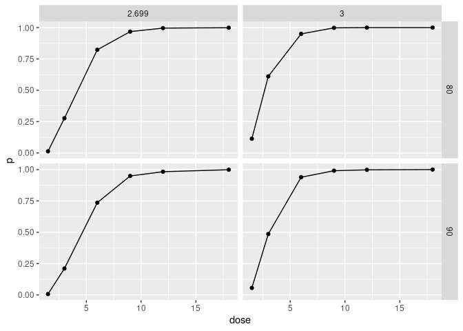
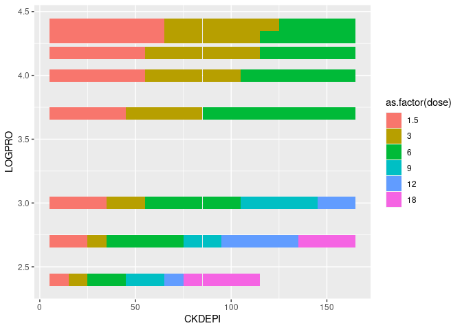
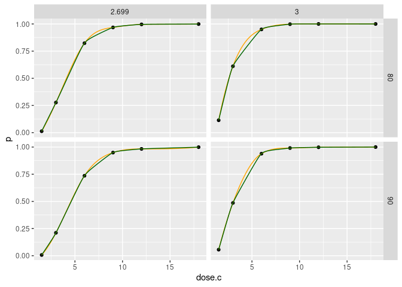
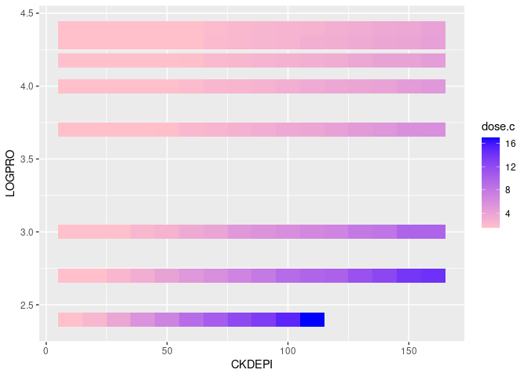
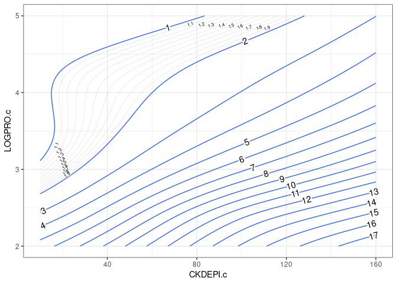
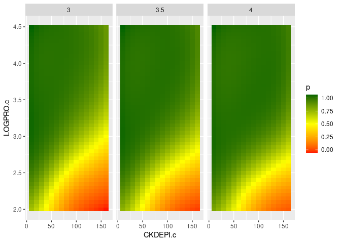

# Load and prepare data


```r
dd <- read.table('./../sdtab020_clean', header = TRUE) %>%
  mutate(across(everything(), as.numeric)
                   , dose = ceil(ID/192)) %>% 
  group_by(ID, CKDEPI, LOGPRO, dose) %>% 
  #filter(TIME==96) %>% 
  summarise(p = sum(C_VENT>=2)/n())
```

```
## `summarise()` has grouped output by 'ID', 'CKDEPI', 'LOGPRO'. You can override using the `.groups` argument.
```

Six discrete doses represent 1.5, ..., 8g of daily Meropenem. LOGPRO measures protein concentrations in unclear units. TIME might not be relevant.

# Replication of figures from manuscript

```r
dd %>% 
  ggplot(aes(x = CKDEPI, y = LOGPRO, fill = p)) +
  geom_tile() +
  facet_wrap(~dose) +
  scale_fill_gradient2(low = 'red', mid = 'yellow', high = 'darkgreen', midpoint = .5)
```

<!-- -->

```r
dd %>% 
  filter(CKDEPI %in% c(40,50,60) & LOGPRO %in% c(2.2, 2.4)) %>% 
  ggplot(aes(x = dose, y = p)) +
  geom_point() + geom_line() +
  facet_grid(CKDEPI ~ LOGPRO) +
  scale_fill_gradient2(low = 'red', mid = 'yellow', high = 'darkgreen', midpoint = .5)
```

<!-- -->

## Inversion


```r
dd %>% ungroup() %>%  group_by(CKDEPI, LOGPRO) %>% 
  filter(p>=0.9) %>% slice(which.min(dose)) %>% 
  ggplot(aes(x = CKDEPI, y = LOGPRO, fill = as.factor(dose))) +
  geom_tile()
```

<!-- -->


# Interpolation

## Only dose


```r
d.plot1 <- dd %>% 
  ungroup() %>% group_by(CKDEPI, LOGPRO) %>% nest() %>% 
  mutate(tps = map(data, ~fields::Tps(.$dose, .$p, lambda = 0))
         , tps.r = map(tps, ~.$fitted.values)
         , dose.c = map(tps, ~seq(1,6,.1))
         , p = map(tps, ~predict(., seq(1,6,.1))[,1])) %>%   unnest(c(dose.c, p))
```


```r
d.plot1 %>% 
  filter(CKDEPI %in% c(40,50,60) & LOGPRO %in% c(2.2, 2.4)) %>% 
  ggplot(aes(x = dose.c, y = p)) +
  geom_point(data = dd %>% filter(CKDEPI %in% c(40,50,60) & LOGPRO %in% c(2.2, 2.4)), aes(x=dose)) +
  geom_line(aes(x=dose.c, y=p), color = 'orange') +
  ggalt::geom_xspline(spline_shape = -0.5, color = 'darkgreen') +
  facet_grid(CKDEPI ~ LOGPRO, scales = 'free')
```

```
## Registered S3 methods overwritten by 'ggalt':
##   method                  from   
##   grid.draw.absoluteGrob  ggplot2
##   grobHeight.absoluteGrob ggplot2
##   grobWidth.absoluteGrob  ggplot2
##   grobX.absoluteGrob      ggplot2
##   grobY.absoluteGrob      ggplot2
```

<!-- -->

No visual difference between ggalt::geom_xspline and fields::Tps.


```r
d.plot1 %>% 
  filter(dose.c %in% c(3,3.5,4)) %>% 
  ggplot(aes(x = CKDEPI, y = LOGPRO, fill = p)) +
  geom_tile() +
  facet_grid(~dose.c) +
  scale_fill_gradient2(low = 'red', mid = 'yellow', high = 'darkgreen', midpoint = .5)
```

<!-- -->

### Inversion


```r
d.plot1 %>% ungroup() %>%  group_by(CKDEPI, LOGPRO) %>% 
  filter(p>=0.9) %>% slice(which.min(dose.c)) %>% 
  ggplot(aes(x = CKDEPI, y = LOGPRO, fill = dose.c)) +
  geom_tile() +
  scale_fill_gradient(low = 'pink', high = 'blue')
```

<!-- -->

### Upsampling


```r
d.plot1 %>% ungroup() %>%  group_by(CKDEPI, LOGPRO) %>% 
  filter(p>=0.9) %>% slice(which.min(dose.c)) %>% 
  ungroup() %>% nest() %>% 
  mutate(tps = map(data, ~fields::Tps(.[c('CKDEPI','LOGPRO')], .$dose.c))
         , tps.xy = map(tps, ~expand_grid(CKDEPI.c = seq(0,160,1), LOGPRO.c = seq(2,4.5,.01)))
         , dose.c = map(tps, ~predict(., expand_grid(seq(0,160,1), seq(2,4.5,.01)), lambda = 0.1)[,1])) %>% 
  unnest(c(tps.xy, dose.c)) %>% 
  ggplot(aes(x = CKDEPI.c, y = LOGPRO.c, fill = dose.c)) +
  geom_tile() +
  scale_fill_gradient(low = 'pink', high = 'blue')
```

```
## Warning: `...` must not be empty for ungrouped data frames.
## Did you want `data = everything()`?
```

<!-- -->

## Only CKD x LOGPRO


```r
d.plot2 <- dd %>%ungroup() %>% group_by(dose) %>% nest() %>% 
  mutate(tps = map(data, ~fields::Tps(.[c('CKDEPI','LOGPRO')], .$p))
         , tps.xy = map(tps, ~expand_grid(CKDEPI.c = seq(0,160,1), LOGPRO.c = seq(2,4.5,.01)))
         , p = map(tps, ~predict(., expand_grid(seq(0,160,1), seq(2,4.5,.01)), lambda = 0.1)[,1])) %>% 
  unnest(c(tps.xy, p))
```

```
## Warning: 
## Grid searches over lambda (nugget and sill variances) with  minima at the endpoints: 
##   (GCV) Generalized Cross-Validation 
##    minimum at  right endpoint  lambda  =  1.016225e-05 (eff. df= 182.3999 )
```

```r
d.plot2 %>% 
  ggplot(aes(x = CKDEPI.c, y = LOGPRO.c, fill = p)) +
  geom_tile() +
  facet_wrap(~dose) +
  scale_fill_gradient2(low = 'red', mid = 'yellow', high = 'darkgreen', midpoint = .5)
```

<!-- -->

```r
d.plot2 %>% 
  filter(CKDEPI.c %in% c(40, 45, 50) & LOGPRO.c %in% c(2.2, 2.3, 2.4)) %>% 
  ggplot(aes(x = dose, y = p)) +
  geom_point() + geom_line() + 
  facet_grid(CKDEPI.c ~ LOGPRO.c) +
  scale_fill_gradient2(low = 'red', mid = 'yellow', high = 'darkgreen', midpoint = .5)
```

<!-- -->

### Inversion


```r
d.plot2 %>% ungroup() %>%  group_by(CKDEPI.c, LOGPRO.c) %>% 
  filter(p>=0.9) %>% slice(which.min(dose)) %>% 
  ggplot(aes(x = CKDEPI.c, y = LOGPRO.c, fill = as.factor(dose))) +
  geom_tile() 
```

<!-- -->

## Both


```r
d.plot3 <- dd %>% ungroup() %>% nest() %>% 
  mutate(tps = map(data, ~fields::Tps(.[c('CKDEPI','LOGPRO','dose')], .$p))
         , tps.xyz = map(tps, ~expand_grid(CKDEPI.c = seq(0,160,1)
                                           , LOGPRO.c = seq(2,4.5,.01)
                                           , dose.c = seq(1,6,.1)))
         , p = map(tps, ~predict(., expand_grid(seq(0,160,1), seq(2,4.5,.01), seq(1,6,.1)), lambda = 0.1)[,1])) %>% 
  unnest(c(tps.xyz, p))
```

```
## Warning: `...` must not be empty for ungrouped data frames.
## Did you want `data = everything()`?
```

```
## Warning: 
## Grid searches over lambda (nugget and sill variances) with  minima at the endpoints: 
##   (GCV) Generalized Cross-Validation 
##    minimum at  right endpoint  lambda  =  0.0001285127 (eff. df= 1094.4 )
```

```r
d.plot3 %>% 
  filter(dose.c %in% c(3,3.5,4)) %>% 
  ggplot(aes(x = CKDEPI.c, y = LOGPRO.c, fill = p)) +
  geom_tile() +
  facet_wrap(~dose.c) +
  scale_fill_gradient2(low = 'red', mid = 'yellow', high = 'darkgreen', midpoint = .5)
```

<!-- -->

```r
d.plot3 %>% 
  filter(CKDEPI.c %in% c(40, 45, 50) & LOGPRO.c %in% c(2.2, 2.3, 2.4)) %>% 
  ggplot(aes(x = dose.c, y = p)) +
  geom_line() + 
  facet_grid(CKDEPI.c ~ LOGPRO.c) +
  scale_fill_gradient2(low = 'red', mid = 'yellow', high = 'darkgreen', midpoint = .5)
```

<!-- -->

### Inversion


```r
d.plot3 %>% ungroup() %>%  group_by(CKDEPI.c, LOGPRO.c) %>% 
  filter(p>=0.9) %>% slice(which.min(dose.c)) %>% 
  ggplot(aes(x = CKDEPI.c, y = LOGPRO.c, fill = dose.c)) +
  geom_tile() +
  scale_fill_gradient(low = 'pink', high = 'blue')
```

<!-- -->

This is an R Markdown document. Markdown is a simple formatting syntax for authoring HTML, PDF, and MS Word documents. For more details on using R Markdown see <http://rmarkdown.rstudio.com>.

When you click the **Knit** button a document will be generated that includes both content as well as the output of any embedded R code chunks within the document. You can embed an R code chunk like this:


```r
summary(cars)
```

```
##      speed           dist       
##  Min.   : 4.0   Min.   :  2.00  
##  1st Qu.:12.0   1st Qu.: 26.00  
##  Median :15.0   Median : 36.00  
##  Mean   :15.4   Mean   : 42.98  
##  3rd Qu.:19.0   3rd Qu.: 56.00  
##  Max.   :25.0   Max.   :120.00
```
