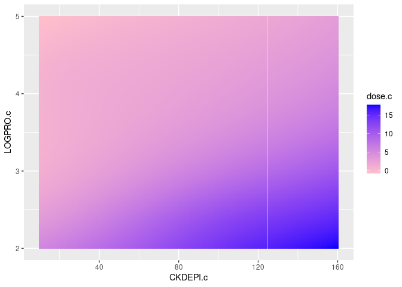

```r
knitr::opts_chunk$set(echo = TRUE, cache = FALSE, cache.lazy = FALSE, warning = FALSE, message = FALSE)
require(tidyverse)
```

```
## Loading required package: tidyverse
```

```
## ── Attaching packages ─────────────────────────────────────── tidyverse 1.3.1 ──
```

```
## ✓ ggplot2 3.3.3     ✓ purrr   0.3.4
## ✓ tibble  3.1.2     ✓ dplyr   1.0.6
## ✓ tidyr   1.1.3     ✓ stringr 1.4.0
## ✓ readr   1.4.0     ✓ forcats 0.5.1
```

```
## ── Conflicts ────────────────────────────────────────── tidyverse_conflicts() ──
## x dplyr::filter() masks stats::filter()
## x dplyr::lag()    masks stats::lag()
```

```r
require(magrittr)
```

```
## Loading required package: magrittr
```

```
## 
## Attaching package: 'magrittr'
```

```
## The following object is masked from 'package:purrr':
## 
##     set_names
```

```
## The following object is masked from 'package:tidyr':
## 
##     extract
```

```r
require(ggplot2)

PTA <- 0.9
MIC <- 2

CKDEPI.subset <- c(40,50)
CKDEPI.c.subset <- c(40,45,50)

LOGPRO.subset <- c(2.2, 2.4)
LOGPRO.c.subset <- c(2.2, 2.3, 2.4)
dose.c.subset <- c(3,3.5,4)

dose.c.range <- seq(1,6,.1)
CKDEPI.c.range <- seq(10,160,10)
LOGPRO.c.range <- seq(2,4.5,.05)
```

# Load and prepare data


```r
dd <- read.table('./../sdtab020_clean', header = TRUE) %>%
  mutate(across(everything(), as.numeric)
                   , dose = ceiling(ID/192)) %>% 
  group_by(ID, CKDEPI, LOGPRO, dose) %>% 
  summarise(p = sum(C_VENT>=MIC)/n())
```

Six discrete doses represent 1.5, ..., 8g of daily Meropenem. LOGPRO measures protein concentrations in unclear units. TIME might not be relevant.

# Replication of figures from manuscript

```r
dd %>% 
  ggplot(aes(x = CKDEPI, y = LOGPRO, fill = p)) +
  geom_tile() +
  facet_wrap(~dose) +
  scale_fill_gradient2(low = 'red', mid = 'yellow', high = 'darkgreen', midpoint = .5)
```

<!-- -->

```r
dd %>% 
  filter(CKDEPI %in% CKDEPI.subset & LOGPRO %in% LOGPRO.subset) %>% 
  ggplot(aes(x = dose, y = p)) +
  geom_point() + geom_line() +
  facet_grid(CKDEPI ~ LOGPRO) +
  scale_fill_gradient2(low = 'red', mid = 'yellow', high = 'darkgreen', midpoint = .5)
```

<!-- -->

## Inversion


```r
dd %>% ungroup() %>%  group_by(CKDEPI, LOGPRO) %>% 
  filter(p>=PTA) %>% slice(which.min(dose)) %>% 
  ggplot(aes(x = CKDEPI, y = LOGPRO, fill = as.factor(dose))) +
  geom_tile()
```

<!-- -->


# Interpolation

## Only dose


```r
d.plot1 <- dd %>% 
  ungroup() %>% group_by(CKDEPI, LOGPRO) %>% nest() %>% 
  mutate(tps = map(data, ~fields::Tps(.$dose, .$p, lambda = 0))
         , tps.r = map(tps, ~.$fitted.values)
         , dose.c = map(tps, ~dose.c.range)
         , p = map(tps, ~predict(., dose.c.range)[,1])) %>%
  unnest(c(dose.c, p))
```


```r
d.plot1 %>% 
  filter(CKDEPI %in% CKDEPI.subset & LOGPRO %in% LOGPRO.subset) %>% 
  ggplot(aes(x = dose.c, y = p)) +
  geom_point(data = dd %>% filter(CKDEPI %in% CKDEPI.subset & LOGPRO %in% LOGPRO.subset), aes(x=dose)) +
  geom_line(aes(x=dose.c, y=p), color = 'orange') +
  ggalt::geom_xspline(spline_shape = -0.5, color = 'darkgreen') +
  facet_grid(CKDEPI ~ LOGPRO)
```

<!-- -->

No visual difference between ggalt::geom_xspline and fields::Tps.


```r
d.plot1 %>% 
  filter(dose.c %in% c(3,3.5,4)) %>% 
  ggplot(aes(x = CKDEPI, y = LOGPRO, fill = p)) +
  geom_tile() +
  facet_grid(~dose.c) +
  scale_fill_gradient2(low = 'red', mid = 'yellow', high = 'darkgreen', midpoint = .5)
```

<!-- -->

### Inversion


```r
d.plot1 %>% ungroup() %>%  group_by(CKDEPI, LOGPRO) %>% 
  filter(p>=PTA) %>% 
  slice(which.min(dose.c)) %>% 
  ggplot(aes(x = CKDEPI, y = LOGPRO, fill = dose.c)) +
  geom_tile() +
  scale_fill_gradient(low = 'pink', high = 'blue')
```

<!-- -->

### Upsampling


```r
d.plot1.up <- d.plot1 %>% ungroup() %>%  group_by(CKDEPI, LOGPRO) %>% 
  filter(p>=PTA) %>% 
  slice(which.min(dose.c)) %>% 
  ungroup() %>% nest() %>% 
  mutate(tps = map(data, ~fields::Tps(.[c('CKDEPI','LOGPRO')], .$dose.c))
         , tps.xy = map(tps, ~expand_grid(CKDEPI.c = CKDEPI.c.range, LOGPRO.c = LOGPRO.c.range))
         , dose.c = map(tps, ~predict(., expand_grid(CKDEPI.c.range, LOGPRO.c.range), lambda = 0.05)[,1])) %>% 
  unnest(c(tps.xy, dose.c)) 
```


```r
d.plot1.up %>% 
  ggplot(aes(x = CKDEPI.c, y = LOGPRO.c, fill = dose.c)) +
  geom_tile() +
  scale_fill_gradient(low = 'pink', high = 'blue')
```

<!-- -->

```r
d.plot1.up %>% 
  ggplot(aes(x = CKDEPI.c, y = LOGPRO.c, z = dose.c)) +
  geom_contour()
```

<!-- -->

## Only CKD x LOGPRO


```r
d.plot2 <- dd %>%ungroup() %>% group_by(dose) %>% nest() %>% 
  mutate(tps = map(data, ~fields::Tps(.[c('CKDEPI','LOGPRO')], .$p))
         , tps.xy = map(tps, ~expand_grid(CKDEPI.c = CKDEPI.c.range, LOGPRO.c = LOGPRO.c.range))
         , p = map(tps, ~predict(., expand_grid(CKDEPI.c.range, LOGPRO.c.range), lambda = 0.1)[,1])) %>% 
  unnest(c(tps.xy, p))
```

```
## Warning: 
## Grid searches over lambda (nugget and sill variances) with  minima at the endpoints: 
##   (GCV) Generalized Cross-Validation 
##    minimum at  right endpoint  lambda  =  1.016225e-05 (eff. df= 182.3999 )
```

```r
d.plot2 %>% 
  ggplot(aes(x = CKDEPI.c, y = LOGPRO.c, fill = p)) +
  geom_tile() +
  facet_wrap(~dose) +
  scale_fill_gradient2(low = 'red', mid = 'yellow', high = 'darkgreen', midpoint = .5)
```

<!-- -->

```r
d.plot2 %>% 
  filter(CKDEPI.c %in% CKDEPI.c.subset & LOGPRO.c %in% LOGPRO.c.subset) %>% 
  ggplot(aes(x = dose, y = p)) +
  geom_point() + geom_line() + 
  facet_grid(CKDEPI.c ~ LOGPRO.c) +
  scale_fill_gradient2(low = 'red', mid = 'yellow', high = 'darkgreen', midpoint = .5)
```

<!-- -->

### Inversion


```r
d.plot2 %>% ungroup() %>%  group_by(CKDEPI.c, LOGPRO.c) %>% 
  filter(p>=PTA) %>% slice(which.min(dose)) %>% 
  ggplot(aes(x = CKDEPI.c, y = LOGPRO.c, fill = as.factor(dose))) +
  geom_tile() 
```

<!-- -->

## Both

NOT RUN


```r
d.plot3 <- dd %>% ungroup() %>% nest() %>% 
  mutate(tps = map(data, ~fields::Tps(.[c('CKDEPI','LOGPRO','dose')], .$p))
         , tps.xyz = map(tps, ~expand_grid(CKDEPI.c = CKDEPI.c.range
                                           , LOGPRO.c = LOGPRO.c.range
                                           , dose.c = dose.c.range))
         , p = map(tps, ~predict(., expand_grid(CKDEPI.c.range, LOGPRO.c.range, dose.c.range), lambda = 0.1)[,1])) %>% 
  unnest(c(tps.xyz, p))

d.plot3 %>% 
  filter(dose.c %in% dose.c.subset) %>% 
  ggplot(aes(x = CKDEPI.c, y = LOGPRO.c, fill = p)) +
  geom_tile() +
  facet_wrap(~dose.c) +
  scale_fill_gradient2(low = 'red', mid = 'yellow', high = 'darkgreen', midpoint = .5)

d.plot3 %>% 
  filter(CKDEPI.c %in% CKDEPI.c.subset & LOGPRO.c %in% LOGPRO.c.subset) %>% 
  ggplot(aes(x = dose.c, y = p)) +
  geom_line() + 
  facet_grid(CKDEPI.c ~ LOGPRO.c) +
  scale_fill_gradient2(low = 'red', mid = 'yellow', high = 'darkgreen', midpoint = .5)
```

### Inversion


```r
d.plot3 %>% ungroup() %>%  group_by(CKDEPI.c, LOGPRO.c) %>% 
  filter(p>=PTA) %>% slice(which.min(dose.c)) %>% 
  ggplot(aes(x = CKDEPI.c, y = LOGPRO.c, fill = dose.c)) +
  geom_tile() +
  scale_fill_gradient(low = 'pink', high = 'blue')

d.plot3 %>% ungroup() %>%  group_by(CKDEPI.c, LOGPRO.c) %>% 
  filter(p>=PTA) %>% slice(which.min(dose.c)) %>% 
  ggplot(aes(x = CKDEPI.c, y = LOGPRO.c, z = dose.c)) +
  geom_contour()
```

