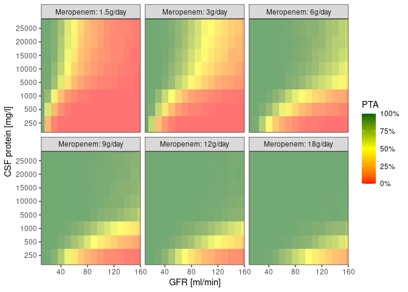
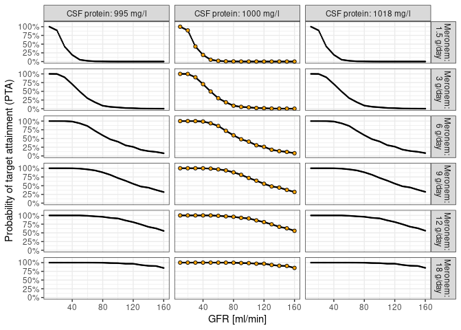
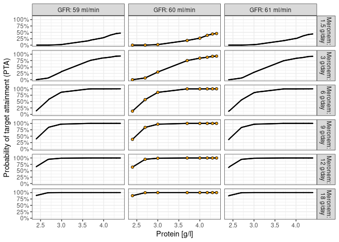
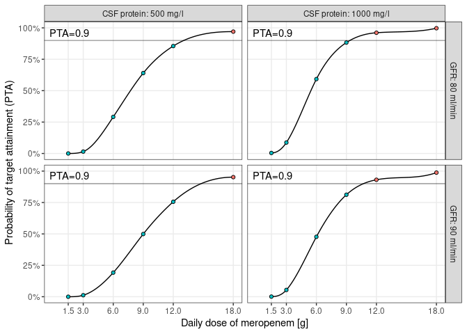
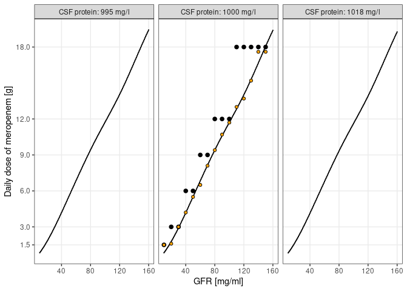
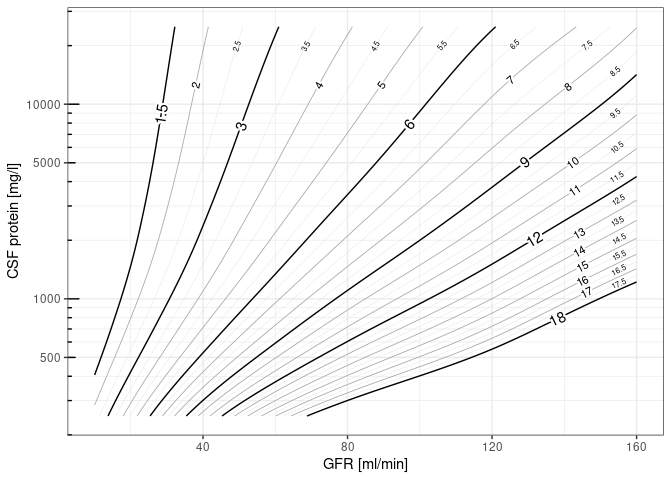
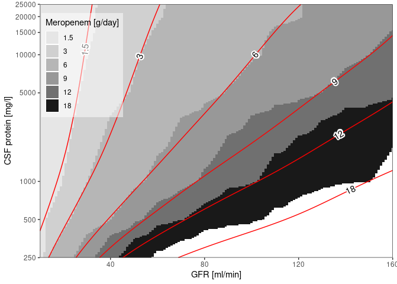
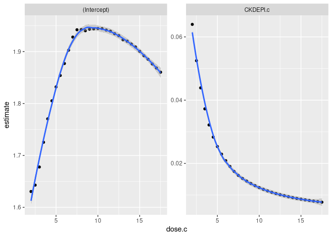
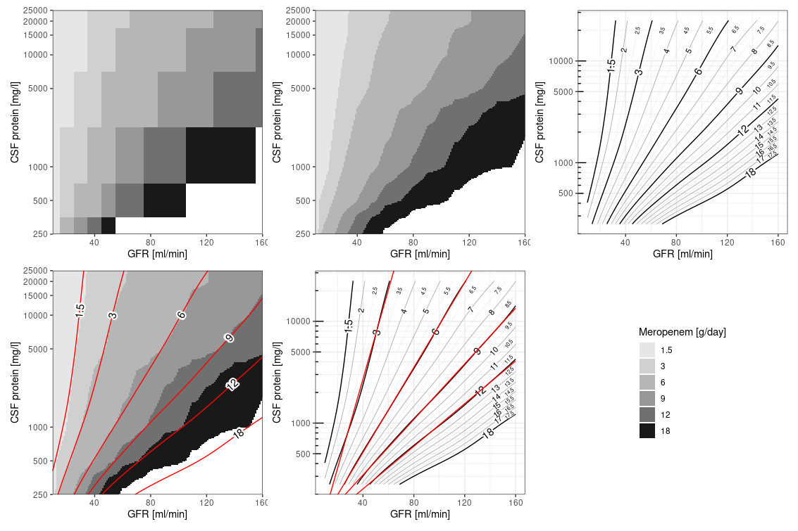

```r
knitr::opts_chunk$set(echo = TRUE, cache = FALSE, cache.lazy = FALSE, warning = FALSE, message = FALSE)
library(chunkhooks)
hook_figure_unit('cm')
require(tidyverse)
require(magrittr)
require(ggplot2)
require(metR)
require(akima)
require(ggvoronoi)
require(patchwork)


PTA <- 0.9
MIC <- 2

CKDEPI.subset <- c(80, 90)
CKDEPI.c.subset <- c(80, 85, 90)

LOGPRO.subset <- c(2.699, 3)
LOGPRO.c.subset <- c(2.5, 2.7, 3)
dose.c.subset <- c(3,4,5,6)
```

# Load and prepare data


```r
d <- read.table('./../sdtab020_1GB_clean_15', header = TRUE) %>%
  mutate(across(everything(), as.numeric)
         , dose = c(1.5, 3, 6, 9, 12, 18)[ceiling(ID/128)]) %>% 
  filter(TIME==96) %>% 
  group_by(ID, CKDEPI, LOGPRO, dose)
```


```r
dd <- d %>% 
  summarise(p = sum(C_VENT>=MIC)/n()) %>% 
  ungroup() %>% group_by(CKDEPI, LOGPRO) %>% arrange(CKDEPI, LOGPRO) %>%
  mutate(p = cummax(p))

dose.c.range <- do.call(seq, c(dd$dose %>% range() %>% as.list(), by=.1)) %>% union(dd$dose %>% unique) %>% sort()
CKDEPI.c.range <- do.call(seq, c(dd$CKDEPI %>% range() %>% as.list(), by=2)) %>% union(dd$CKDEPI %>% unique) %>% sort()
LOGPRO.c.range <- do.call(seq, c(dd$LOGPRO %>% range() %>% as.list(), by=.025)) %>% union(dd$LOGPRO %>% unique) %>% sort()

grid <- expand_grid(CKDEPI = CKDEPI.c.range %>% union(dd$CKDEPI %>% unique), LOGPRO = LOGPRO.c.range %>% union(dd$LOGPRO %>% unique))
```


```r
dd %>% ungroup() %>% mutate(r = dense_rank(LOGPRO)) %>% 
  ggplot(aes(x = CKDEPI, y = r)) +
  #stat_voronoi(geom = "path", size = 0, alpha = 1) +
  geom_voronoi(aes(fill = p, alpha = .5)) +
  facet_wrap(~dose, labeller = labeller(dose = function(x)paste0('Meropenem: ', x, 'g/day'))) +
  scale_x_continuous('GFR [ml/min]', expand = c(0,0)) +
  scale_y_continuous('CSF protein [mg/l]', breaks = 1:8, labels = 10*round((10^dd$LOGPRO %>% unique())/10), expand = c(0,0)) +
  scale_fill_gradient2(low = 'red', mid = 'yellow', high = 'darkgreen', midpoint = .5, labels = scales::percent) +
  guides(alpha=FALSE, fill = guide_colorbar('PTA', direction = 'vertical', title.position = 'top'))+
  coord_cartesian(xlim = dd$CKDEPI %>% range()) +
  theme_bw() +
  theme(panel.grid = element_blank())
```

<!-- -->

```r
ggsave(paste0('./plots/PTA_MIC_', MIC, '.png'), units = 'cm', width = 30, height = 20)
```
## Inversion


```r
p.dosebanding <- dd %>% ungroup() %>% 
  group_by(CKDEPI, LOGPRO) %>% 
  filter(p>=PTA) %>% slice(which.min(dose)) %>% 
  ungroup() %>% 
  complete(CKDEPI, LOGPRO, fill = list(dose = NA)) %>% 
  ggplot(aes(x = CKDEPI, y = 10^LOGPRO, fill = as.factor(dose), alpha = dose)) +
  #stat_voronoi(geom = "path", size = 0, alpha = 1, na.rm = TRUE) +
  geom_voronoi(na.rm = TRUE) + 
  scale_x_continuous('GFR [ml/min]', expand = c(0,0)) +
  scale_y_continuous('CSF protein [mg/l]', trans = 'log10', breaks = 10^dd$LOGPRO %>% unique(), labels = 10*round((10^dd$LOGPRO %>% unique())/10), expand = c(0,0)) +
  scale_fill_grey(breaks = dd$dose %>% unique(), start = .9, end = .1) +
  scale_alpha(range = 1, na.value = 0) +
  guides(alpha=FALSE, fill = guide_legend('Meropenem [g/day]', direction = 'vertical', title.position = 'top'))+
  coord_cartesian(ylim = 10^range(LOGPRO.c.range), xlim = dd$CKDEPI %>% range()) +
  theme_bw() +
  theme(legend.position = c(.115,.75)
        , legend.background = element_rect(fill = alpha('white', .5))
        , panel.grid = element_blank())

p.dosebanding
```

<!-- -->


```r
temp <- dd %>% ungroup() %>% group_by(dose, CKDEPI) %>% 
  mutate(dose.c = -cummax(-p)) %>% 
  ungroup() %>% group_by(dose, LOGPRO) %>% 
  mutate(dose.c = cummax(p)) %>% 
  ungroup() %>% group_by(dose) %>% nest() %>% 
  mutate(xy = list(grid),
    z = map(data, ~interp(x = .$CKDEPI, y = .$LOGPRO, z = .$p, xo = grid$CKDEPI %>% unique(), yo = grid$LOGPRO %>% unique(), linear = TRUE, extrap = FALSE)$z %>% t() %>% as.vector())) %>% 
  unnest(c(xy,z)) %>% 
  rename(p = z, CKDEPI.c = CKDEPI, LOGPRO.c = LOGPRO)
  
temp %>% 
  filter(LOGPRO.c %in% LOGPRO.c.range[which(LOGPRO.c.range==3)+c(-1,0,1)]) %>% 
  ggplot(aes(x = CKDEPI.c, y = p)) +
  geom_point(size = .2) + geom_line() +
  geom_point(data = dd %>% filter(LOGPRO %in% LOGPRO.c.range[which(LOGPRO.c.range==3)+c(-1,0,1)]) %>% rename(CKDEPI.c = CKDEPI, LOGPRO.c = LOGPRO), fill = 'orange', shape = 21) +
  facet_grid(dose ~ LOGPRO.c, labeller = labeller(LOGPRO.c = function(x)paste0('CSF protein: ',round(10^as.numeric(x)), ' mg/l')
                                                  , dose = function(x)paste0('Meronem:\n', x, ' g/day'))) +
  scale_x_continuous('GFR [ml/min]') +
  scale_y_continuous('Probability of target attainment (PTA)', breaks = seq(0,1,.25), labels = scales::percent, limits = c(0,1)) +
  theme_bw()
```

<!-- -->

```r
temp %>% 
  filter(CKDEPI.c %in% CKDEPI.c.range[which(CKDEPI.c.range==60)+c(-1,0,1)]) %>% 
  ggplot(aes(x = LOGPRO.c, y = p)) +
  geom_point(size = .2) + geom_line() +
  geom_point(data = dd %>% filter(CKDEPI %in% CKDEPI.c.range[which(CKDEPI.c.range==60)+c(-1,0,1)]) %>% rename(CKDEPI.c = CKDEPI, LOGPRO.c = LOGPRO), fill = 'orange', shape = 21) +
  facet_grid(dose ~ CKDEPI.c, labeller = labeller(CKDEPI.c = function(x)paste0('GFR: ',x, ' ml/min')
                                                  , dose = function(x)paste0('Meronem:\n', x, ' g/day'))) +
  scale_x_continuous('Protein [g/l]') +
  scale_y_continuous('Probability of target attainment (PTA)', breaks = seq(0,1,.25), labels = scales::percent, limits = c(0,1)) +
  theme_bw()
```

<!-- -->

```r
p.dosebanding.interp <- temp %>% 
  ungroup() %>%  group_by(CKDEPI.c, LOGPRO.c) %>% 
  filter(p>=PTA) %>% slice(which.min(dose)) %>% 
  ungroup() %>% 
  complete(CKDEPI.c, LOGPRO.c, fill = list(dose = NA)) %>% 
  ggplot(aes(x = CKDEPI.c, y = 10^LOGPRO.c, fill = as.factor(dose), alpha = dose)) +
  #stat_voronoi(geom = "path", size = 0, alpha = 1, na.rm = TRUE) +
  geom_voronoi(na.rm = TRUE) + 
  scale_x_continuous('GFR [ml/min]', expand = c(0,0)) +
  scale_y_continuous('CSF protein [mg/l]', trans = 'log10', breaks = 10^dd$LOGPRO %>% unique(), labels = 10*round((10^dd$LOGPRO %>% unique())/10), expand = c(0,0)) +
  scale_fill_grey(breaks = dd$dose %>% unique(), start = .9, end = .1) +
  scale_alpha(range = 1, na.value = 0) +
  guides(alpha=FALSE, fill = guide_legend('Meropenem [g/day]', direction = 'vertical', title.position = 'top'))+
  coord_cartesian(ylim = 10^range(LOGPRO.c.range), xlim = range(CKDEPI.c.range)) +
  theme_bw() +
  theme(legend.position = c(.12, .76)
        , legend.background = element_rect(fill = alpha('white', .5))
        , panel.grid = element_blank())

p.dosebanding.interp
```

<!-- -->

```r
d.plot1 <- dd %>% 
  ungroup() %>% group_by(CKDEPI, LOGPRO) %>% nest() %>% 
  mutate(sp = map(data, ~data.frame(spline(.$dose, .$p, method = 'hyman', xout = dose.c.range)) %>% setNames(c('dose.c','p')))) %>%
  unnest(sp)
```


```r
d.plot1 %>% 
  filter(CKDEPI %in% CKDEPI.subset & LOGPRO %in% LOGPRO.subset) %>% 
  ggplot(aes(x = dose.c, y = p)) +
  geom_line(aes(x=dose.c, y=p), color = 'black') +
  geom_point(data = dd %>% filter(CKDEPI %in% CKDEPI.subset & LOGPRO %in% LOGPRO.subset), aes(x=dose), shape = 21, fill = 'orange') +
  facet_grid(CKDEPI ~ LOGPRO, labeller = labeller(LOGPRO = function(x)paste0('CSF protein: ',round(10^as.numeric(x)), ' mg/l')
                                                  , CKDEPI = function(x)paste0('GFR: ', x, ' ml/min'))) +
  scale_x_continuous('Daily dose of meropenem [g]', breaks = dd$dose %>% unique()) +
  scale_y_continuous('Probability of target attainment (PTA)', breaks = seq(0,1,.25), labels = scales::percent, limits = c(0,1)) +
  theme_bw() +
  theme(panel.grid.minor = element_blank())
```

<!-- -->


### Upsampling


```r
temp <- d.plot1 %>% ungroup() %>%  group_by(CKDEPI, LOGPRO) %>% 
  filter(p>=PTA) %>% 
  slice(which.min(dose.c)) %>% 
  ungroup() %>% 
  complete(CKDEPI, LOGPRO, fill = list(dose.c = 18.01)) %>% 
  group_by(CKDEPI) %>% 
  mutate(dose.c = -cummax(-dose.c)) %>% 
  ungroup() %>% group_by(LOGPRO) %>% 
  mutate(dose.c = cummax(dose.c))

z <- interp(x = temp$CKDEPI, y = temp$LOGPRO, z = temp$dose.c, xo = grid$CKDEPI %>% unique(), yo = grid$LOGPRO %>% unique(), linear = TRUE, extrap = FALSE)$z %>% t() %>% as.vector()

grid %>% bind_cols(data.frame(dose.c = z %>% t() %>% as.vector())) %>%
  rename(CKDEPI.c = CKDEPI, LOGPRO.c = LOGPRO) %>% 
  filter(CKDEPI.c%%5==0) %>% 
  ggplot(aes(x = LOGPRO.c, y = dose.c)) +
  geom_point(size=.1) + geom_line() +
  geom_point(data = dd %>% ungroup() %>%  group_by(CKDEPI, LOGPRO) %>% filter(p>=PTA) %>% slice(which.min(dose)) %>% rename(CKDEPI.c = CKDEPI, LOGPRO.c = LOGPRO) %>% filter(CKDEPI.c%%5==0), aes(x=LOGPRO.c, y = dose), size=2, shape=21) +
  geom_point(data = temp %>% rename(LOGPRO.c = LOGPRO, CKDEPI.c = CKDEPI), fill='orange', shape = 21) +
  facet_wrap(~ CKDEPI.c, labeller = labeller(CKDEPI.c = function(x)paste0('GFR: ', x, ' ml/min'))) +
  scale_x_continuous('Protein [g/l]', breaks = dd$LOGPRO %>% unique(), labels = 10*round((10^dd$LOGPRO %>% unique())/10)) +
  scale_y_continuous('Daily dose of meropenem [g]', breaks = dd$dose %>% unique()) +
  theme_bw() +
  theme(axis.text.x = element_text(angle = 90, vjust = 0.5, hjust = 1, size = 6)
        , axis.text.y = element_text(size = 6)
        , panel.grid.minor = element_blank())
```

<!-- -->

```r
grid %>% bind_cols(data.frame(dose.c = z %>% t() %>% as.vector())) %>%
  rename(CKDEPI.c = CKDEPI, LOGPRO.c = LOGPRO) %>% 
  filter(LOGPRO.c %in% LOGPRO.c.range[which(LOGPRO.c.range==3)+c(-1,0,1)]) %>% 
  ggplot(aes(x = CKDEPI.c, y = dose.c,)) +
  geom_point(size=.1) + geom_line() +
  geom_point(data = dd %>% ungroup() %>%  group_by(CKDEPI, LOGPRO) %>% filter(p>=PTA) %>% slice(which.min(dose)) %>% rename(CKDEPI.c = CKDEPI, LOGPRO.c = LOGPRO) %>% filter(LOGPRO.c %in% LOGPRO.c.range[which(LOGPRO.c.range==3)+c(-1,0,1)]), aes(x = CKDEPI.c, y = dose), size=2) +
  geom_point(data = temp %>% rename(LOGPRO.c = LOGPRO, CKDEPI.c = CKDEPI) %>% filter(LOGPRO.c %in% LOGPRO.c.range[which(LOGPRO.c.range==3)+c(-1,0,1)]), fill='orange', shape = 21) +
  facet_wrap(~ LOGPRO.c, labeller = labeller(LOGPRO.c = function(x)paste0('CSF protein: ',round(10^as.numeric(x)), ' mg/l'))) +
  scale_x_continuous('GFR [mg/ml]') +
  scale_y_continuous('Daily dose of meropenem [g]', breaks = dd$dose %>% unique()) +
  theme_bw() +
  theme(panel.grid.minor = element_blank())
```

<!-- -->


```r
c1 <- setdiff(c(dd$dose %>% unique, 1.50001),c(1.5)) %>% sort()
c2 <- setdiff(seq(2, dd$dose %>% max(), by = 1), union(c(1.5, 18), c1))
c3 <- setdiff(seq(2, dd$dose %>% max(), by = .5), union(c(1.5, 18), union(c1, c2)))

breaks <- rep(c(1,5), 21)*(10^rep(-10:10, each=2))
minor_breaks <- rep(1:9, 21)*(10^rep(-10:10, each=9))

p.contour <- grid %>% bind_cols(data.frame(z = z %>% t() %>% as.vector())) %>% 
  ggplot(aes(x=CKDEPI, y=10^LOGPRO, fill=z, z=z)) + 
  geom_contour(breaks = c1, color = 'black') +
  metR::geom_text_contour(stroke = 0.2, breaks = c1,  skip = 0, label.placement = label_placement_fraction(frac = c(.75))) +
  
  geom_contour(size = .3, breaks = c2, color = 'darkgrey') +
  metR::geom_text_contour(stroke = 0.2, size = 3, breaks = c2, skip = 0, label.placement = label_placement_fraction(frac = c(.85))) +
  
  geom_contour(size=.1, breaks = c3, color = 'lightgrey') +
  metR::geom_text_contour(stroke = 0.1, size = 2, breaks =  c3, skip = 0, label.placement = label_placement_fraction(frac = c(.95))) +
  annotation_logticks(sides = "l") +
  scale_x_continuous('GFR [ml/min]') +
  scale_y_continuous('CSF protein [mg/l]', trans = 'log10', breaks = breaks, minor_breaks = minor_breaks) +
  scale_fill_gradient(low = 'lightgrey', high = 'black', breaks = dd$dose %>% unique()) +
  scale_alpha(range = 1, na.value = 0) +
  coord_cartesian(ylim = 10^range(LOGPRO.c.range), xlim = range(CKDEPI.c.range)) +
  theme_bw()

p.contour
```

<!-- -->


```r
p.overlay <- p.dosebanding.interp +
  geom_contour(data = grid %>% bind_cols(data.frame(z = z %>% t() %>% as.vector())), aes(x=CKDEPI, y=10^LOGPRO, fill=z, z=z), inherit.aes = FALSE, breaks = c1, color = 'red') +
  metR::geom_text_contour(data = grid %>% bind_cols(data.frame(z = z %>% t() %>% as.vector())), aes(x=CKDEPI, y=10^LOGPRO, fill=z, z=z), inherit.aes = FALSE, stroke = 0.2, breaks = c1, skip = 0, label.placement = label_placement_fraction(frac = c(.8))) +
  theme(panel.grid.minor = element_blank())

p.overlay
```

<!-- -->


```r
line.fcn <- function(x,m,b){10^(m*x+b)}
d.lines <- grid %>% 
  bind_cols(data.frame(z = z %>% t() %>% as.vector())) %>% 
  rename(dose.c = z, CKDEPI.c = CKDEPI, LOGPRO.c = LOGPRO) %>% 
  filter(abs(dose.c - round(2*dose.c)/2)<0.1) %>%
  mutate(dose.c = round(2*dose.c)/2) %>% 
  filter(dose.c >= 2 & dose.c < 18) %>% 
  arrange(dose.c) %>% group_by(dose.c) %>% nest() %>% 
  mutate(mdl = map(data, ~lm(LOGPRO.c ~ CKDEPI.c, data = .))
         , tidy = map(mdl, broom::tidy)
         , gf = map(tidy, ~geom_function(data=data.frame(x=seq(10,160,1))
                                         , aes(x=x)
                                         , inherit.aes = FALSE
                                         , fun = line.fcn
                                         , color = 'red'
                                         , args = list(m=.$estimate[2], b=.$estimate[1])))) 
p.nomogram <- p.contour +
  d.lines$gf[d.lines$dose.c %in% c(3,6,9,12,18)]

d.lines %>% 
  unnest(c(tidy)) %>% 
  ggplot(aes(x = dose.c, y = estimate)) +
  geom_point() +
  geom_smooth(span=.5) +
  facet_wrap(~term, scales = 'free')
```

<!-- -->

```r
d.lines %>% 
  unnest(c(tidy)) %>% 
  select(dose.c, term, estimate) %>% 
  pivot_wider(names_from = term, values_from = estimate) %>% 
  rename(dose = dose.c, b = `(Intercept)`, m = CKDEPI.c) %>% 
  write_csv(paste0('./../python/nomogram_data_MIC_', MIC, '.csv'), col_names = TRUE)
```


```r
(p.dosebanding + p.dosebanding.interp + p.contour + p.overlay + p.nomogram) + guide_area() + plot_layout(guides = 'collect')
```

<!-- -->

```r
ggsave(paste0('./plots/nomograms_MIC_', MIC, '.png'), units = 'cm', width = 30, height = 20)
```


